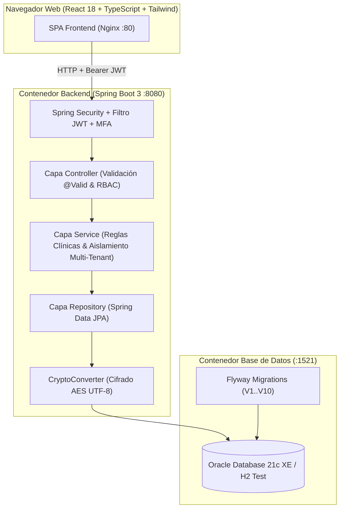
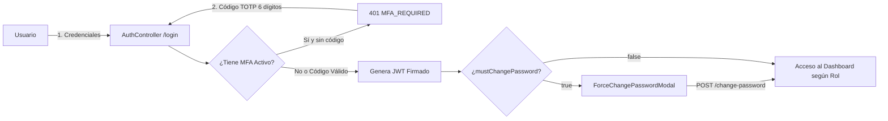
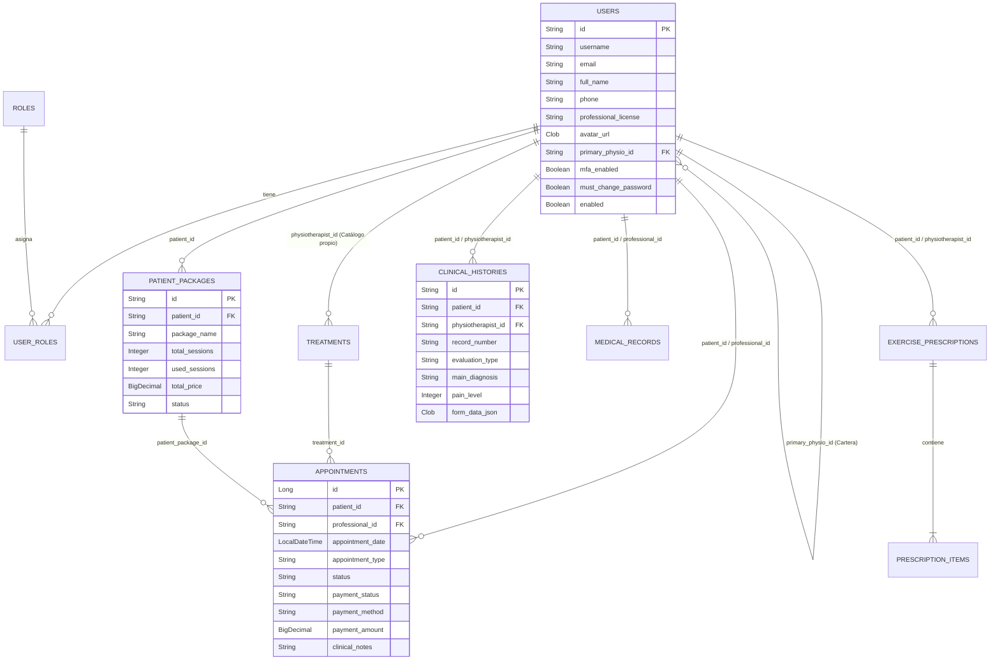

# 🏥 FisioApp (Fisio-Tec) — Plataforma Clínica Full-Stack Multi-Tenant

Sistema integral de gestión clínica, biomecánica y administrativa para clínicas de **Fisioterapia y Rehabilitación**, construido bajo arquitectura limpia por capas con **Java 17, Spring Boot 3.2.4, Oracle Database 21c XE, Flyway, React 18, TypeScript, Tailwind CSS y Docker**.

---

## 📋 Descripción General

**FisioApp** evolucionó de un módulo base de autenticación a una solución **HealthTech SaaS Multi-Tenant** completa que resuelve la operación diaria de una clínica de rehabilitación respetando estándares de privacidad y normativas médicas (como la **NOM-004-SSA3 del Expediente Clínico**):

- **Aislamiento Estricto Multi-Tenant por Rol:**
  - `ROLE_FISIOTERAPEUTA`: Gestiona de forma privada y aislada su propia cartera de pacientes (`primaryPhysio`), su catálogo personal de tratamientos y tarifas, su agenda, sus prescripciones de ejercicio, sus historias clínicas y sus métricas de ingresos.
  - `ROLE_PACIENTE`: Acceso exclusivo a sus propias citas, su expediente clínico, sus rutinas de rehabilitación prescritas y el catálogo de tratamientos de su fisioterapeuta asignado.
  - `ROLE_ADMIN`: Supervisión global de la clínica, alta de personal médico y ejecución del **Derecho al Olvido (Anonimización Irreversible ARCO/GDPR)**.
- **Historia Clínica Fisioterapéutica de 7 Hojas:** Evaluación estructurada con signos vitales, antecedentes patológicos, escala de dolor EVA (0-10), **Mapa Corporal Interactivo** de puntos dolorosos, goniometría articular (ROM), fuerza muscular (Escala Daniels 0-5), análisis postural/marcha, diagnóstico CIE-10/CIF y **doble firma digital en lienzo táctil (Canvas)** con impresión/exportación clínica.
- **Inmutabilidad Médica y Sistema de Adendas:** Las notas clínicas y citas completadas se sellan de forma inmutable; cualquier aclaración posterior se registra como una **Adenda fechada** sin alterar el registro histórico original.
- **Control Financiero y Paquetes de Sesiones:** Cobro por sesión individual (`EFECTIVO`, `TARJETA`, `TRANSFERENCIA`) o venta y descuento automatizado de **Paquetes de Sesiones (`PatientPackage`)** con protección contra doble cobro.
- **Seguridad Avanzada:** Autenticación stateless con **JWT**, Segundo Factor de Autenticación (**MFA TOTP** con Google Authenticator), cambio forzado de contraseña temporal en el primer inicio de sesión, **cifrado AES en base de datos (`CryptoConverter` con UTF-8)** para diagnósticos y notas sensibles, y bitácora de auditoría (`AuditLog`).

---

## 🗂️ Estructura del Proyecto (Full-Stack)

```text
app-fisio/
├── .github/workflows/
│   └── maven-publish.yml              # Pipeline CI/CD en GitHub Actions (Build & Test)
├── docker-compose.yml                 # Orquestación: Oracle 21c XE + Backend API + Frontend Nginx
├── Dockerfile                         # Build multi-stage para Spring Boot (Java 17)
├── pom.xml                            # Configuración Maven y dependencias
├── src/main/
│   ├── java/com/fisitec/appfisio/
│   │   ├── config/                    # SecurityConfig, OpenApiConfig, DataInitializer, AuditorAware
│   │   ├── controller/                # Controladores REST (Auth, Patient, Appointment, ClinicalHistory, etc.)
│   │   ├── dto/                       # Contratos de entrada/salida (RequestDTO / ResponseDTO)
│   │   ├── entity/                    # Entidades JPA (User, Role, Appointment, ClinicalHistory, etc.)
│   │   ├── exception/                 # Manejo centralizado de errores (@RestControllerAdvice)
│   │   ├── repository/                # Repositorios Spring Data JPA
│   │   ├── security/                  # Filtros JWT, EntryPoint y CryptoConverter (AES UTF-8)
│   │   └── service/                   # Reglas de negocio, aislamiento multi-tenant y transacciones
│   └── resources/
│       ├── application*.properties    # Perfiles dev (H2) y prod (Oracle 21c)
│       └── db/migration/              # Migraciones versionadas con Flyway (V1 a V10)
└── frontend/                          # Aplicación SPA en React 18 + TypeScript + Vite + Tailwind CSS
    ├── Dockerfile                     # Build multi-stage con Node 20 y servidor Nginx
    ├── nginx.conf                     # Configuración SPA, proxy inverso /api/ y límite de carga (5MB)
    └── src/
        ├── api/axios.ts               # Cliente HTTP con inyección automática de Bearer JWT
        ├── components/                # Layout responsivo (Sidebar, Header, BottomNav) y UI reutilizable
        ├── context/                   # AuthContext y ThemeContext
        ├── features/                  # Módulos por dominio:
        │   ├── appointments/          # Agenda, cobros individuales, venta de paquetes y notas con adendas
        │   ├── auth/                  # Login con MFA y modal de cambio obligatorio de contraseña
        │   ├── dashboard/             # Métricas clínicas y financieras aisladas por fisioterapeuta
        │   ├── patients/              # Directorio, alta con clave temporal y aviso de privacidad
        │   ├── prescriptions/         # Rutinas de ejercicios terapéuticos y seguimiento
        │   ├── profile/               # Perfil profesional con avatar, teléfono y cédula profesional
        │   ├── records/               # Expediente clínico y visor/editor de Historia Clínica (7 Hojas)
        │   ├── staff/                 # Gestión de fisioterapeutas y personal (Admin)
        │   └── treatments/            # Catálogo de servicios y tarifas por fisioterapeuta
        ├── routes/                    # Rutas protegidas por rol (RoleProtectedRoute)
        └── types/                     # Interfaces y contratos TypeScript
```

---

## 🏗️ Diagramas de Arquitectura

### 1. Arquitectura Full-Stack y Contenedores



### 2. Flujo de Autenticación, MFA y Cambio de Contraseña Temporal



### 3. Modelo Entidad-Relación (Esquema Clínico)



---

## 🔌 Principales Endpoints de la API

| Módulo           | Método     | Ruta                                      | Descripción                                                                      | Roles Permitidos             |
| ---------------- | ---------- | ----------------------------------------- | -------------------------------------------------------------------------------- | ---------------------------- |
| **Auth**         | `POST`     | `/api/auth/login`                         | Login con soporte para código MFA TOTP y detección de clave temporal.            | Público                      |
| **Auth**         | `POST`     | `/api/auth/register`                      | Registro público de usuario con rol paciente.                                    | Público                      |
| **Perfil**       | `GET/PUT`  | `/api/v1/users/profile`                   | Consulta y actualización de perfil (nombre, teléfono, cédula y avatar).          | Autenticado                  |
| **Perfil**       | `POST`     | `/api/v1/users/change-password`           | Actualización de contraseña y liberación del bloqueo temporal.                   | Autenticado                  |
| **Pacientes**    | `GET`      | `/api/v1/patients`                        | Directorio aislado (Fisio ve solo su cartera; Admin ve todos).                   | `ADMIN`, `FISIO`             |
| **Pacientes**    | `POST`     | `/api/v1/patients`                        | Alta rápida con generación de usuario, clave temporal y vínculo `primaryPhysio`. | `ADMIN`, `FISIO`             |
| **Pacientes**    | `DELETE`   | `/api/v1/patients/{id}`                   | Ejecución de Derecho al Olvido (Anonimización irreversible).                     | `ADMIN`                      |
| **Citas**        | `GET`      | `/api/v1/appointments`                    | Agenda filtrada según el usuario autenticado.                                    | Autenticado                  |
| **Citas**        | `POST`     | `/api/v1/appointments`                    | Creación de cita con validación de horario y sincronización de calendario.       | Autenticado                  |
| **Citas**        | `PATCH`    | `/api/v1/appointments/{id}/notes`         | Guardado de notas evolutivas y adendas clínicas fechadas.                        | `ADMIN`, `FISIO`             |
| **Pagos**        | `POST`     | `/api/v1/payments/packages`               | Venta de paquete de sesiones a un paciente.                                      | `ADMIN`, `FISIO`             |
| **Pagos**        | `PUT`      | `/api/v1/payments/appointments/{id}`      | Cobro de cita individual o descuento automático de sesión de paquete.            | `ADMIN`, `FISIO`             |
| **Tratamientos** | `GET/POST` | `/api/v1/treatments`                      | Catálogo aislado por fisioterapeuta (el paciente ve los de su fisio asignado).   | Autenticado                  |
| **Historia 7H**  | `POST`     | `/api/v1/clinical-histories`              | Crea o actualiza valoración de 7 hojas con blindaje de autoría y ventana de 24h. | `ADMIN`, `FISIO`             |
| **Historia 7H**  | `GET`      | `/api/v1/clinical-histories/patient/{id}` | Historial de valoraciones clínicas con candado anti-IDOR.                        | `ADMIN`, `FISIO`, `PACIENTE` |
| **Expediente**   | `GET/POST` | `/api/v1/medical-records`                 | Notas clínicas cifradas con AES-UTF8 en base de datos y registro en `AuditLog`.  | `ADMIN`, `FISIO`, `PACIENTE` |
| **Ejercicios**   | `GET/POST` | `/api/v1/prescriptions`                   | Prescripción de rutinas terapéuticas con series, repeticiones y estado.          | `ADMIN`, `FISIO`, `PACIENTE` |
| **Dashboard**    | `GET`      | `/api/v1/dashboard/summary`               | KPIs clínicos e ingresos calculados exclusivamente para el fisio en sesión.      | `ADMIN`, `FISIO`             |

---

## 🛠️ Bitácora de Ingeniería: Problemas Encontrados, Auditoría y Soluciones Aplicadas

Durante el desarrollo y las rondas de auditoría arquitectónica, se identificaron y resolvieron retos reales de ingeniería de software que fortalecieron la plataforma:

1. **Aislamiento Multi-Tenant y Prevención de Fugas de Datos (IDOR):**
   - _Problema detectado:_ Inicialmente, un fisioterapeuta recién creado veía métricas globales o tratamientos de otros colegas, y un paciente podía consultar catálogos generales. Además, cuando un fisio registraba un paciente pero aún no le agendaba su primera cita, el contador del Dashboard marcaba `0`.
   - _Solución:_ Se incorporó la relación `primary_physio_id` en `USERS` y `physiotherapist_id` en `TREATMENTS`. Se blindaron `DashboardService`, `PatientService` y `TreatmentService` para combinar pacientes con cita e integrantes directos de la cartera del fisio, y se añadieron candados `403 Forbidden` en los controladores para impedir que un paciente consulte IDs ajenos.
2. **Restricciones Únicas Globales en Oracle vs. Catálogos por Fisioterapeuta:**
   - _Problema detectado:_ La tabla `TREATMENTS` tenía una restricción `UNIQUE(name)` global en `V1__baseline.sql`, lo que impedía que dos fisioterapeutas distintos registraran un servicio con el mismo nombre (ej. _"Valoración Inicial"_).
   - _Solución:_ Se creó la migración `V9__drop_treatment_name_global_unique.sql` con un bloque PL/SQL dinámico en Oracle para eliminar el constraint global y permitir catálogos independientes por profesional.
3. **Integridad en el Cobro con Paquetes de Sesiones y Pruebas en CI/CD:**
   - _Problema detectado:_ Al descontar una sesión de un paquete (`PatientPackage`), era necesario garantizar que la cita pasara automáticamente a `PAGADO` y `COMPLETED`, validar que el paquete perteneciera efectivamente al paciente de esa cita, impedir cobros duplicados sobre citas ya saldadas y devolver el DTO completo (incluyendo `clinicalNotes` y `appointmentType`) para que la UI no perdiera datos en memoria.
   - _Solución:_ Se endureció `PaymentService.updateAppointmentPayment` con validaciones de propiedad y estado, y se alineó la suite de pruebas unitarias (`PaymentServiceTest`) con el pipeline de GitHub Actions.
4. **Cifrado Clínico Multi-Plataforma (`CryptoConverter` UTF-8):**
   - _Problema detectado:_ El uso de `String.getBytes()` sin especificar conjunto de caracteres en Java depende del sistema operativo anfitrión, lo que podía corromper acentos y la letra `ñ` al mover datos cifrados con AES entre Windows (desarrollo) y contenedores Linux Alpine (Docker).
   - _Solución:_ Se forzó explícitamente `StandardCharsets.UTF_8` tanto en el cifrado como en la desencriptación y derivación de llave.
5. **Inmutabilidad Clínica (NOM-004), Autoría y Lienzos de Firma Independientes:**
   - _Problema detectado:_ Si un administrador editaba una historia clínica, su usuario podía sobrescribir al fisioterapeuta autor original; además, en el visor de 7 hojas, limpiar el canvas de firma del fisioterapeuta reiniciaba en el estado la firma del paciente.
   - _Solución:_ Se restringió la asignación del autor únicamente al bloque de creación en `ClinicalHistoryService`, y se parametrizó `clearSignature(canvas, 'patient' | 'physio')` en `ClinicalHistoryViewer.tsx` para mantener ambos lienzos de firma completamente aislados.
6. **Entrega de Credenciales Temporales en Alta Rápida de Pacientes:**
   - _Problema detectado:_ El backend generaba una contraseña temporal (`App-xxxxx`) con `mustChangePassword = true`, pero el modal del frontend no la mostraba en pantalla ni persistía el nombre completo (`fullName`) en la entidad `User`.
   - _Solución:_ Se actualizó `PatientService` para persistir `fullName` y `PatientModal.tsx` para desplegar las credenciales iniciales listas para compartir con el paciente.

---

## 🚀 Cómo Ejecutar el Proyecto

### Opción 1: Entorno Completo con Docker Compose (Recomendado — Con Oracle 21c XE)

1. Clona el repositorio y levanta los 3 contenedores (`appfisio-oracle`, `fisio-backend`, `fisio-frontend`):
   ```bash
   docker compose up -d --build
   ```
2. Accede a la aplicación:
   - **Aplicación Web (Frontend Nginx):** `http://localhost`
   - **API Backend & Swagger UI:** `http://localhost:8080/swagger-ui/index.html`

### Opción 2: Ejecución Local para Desarrollo y Pruebas Unitarias

1. **Ejecutar la suite de pruebas unitarias (con H2 en memoria):**
   ```bash
   mvn test
   ```
2. **Levantar el Backend localmente (perfil `dev`):**
   ```bash
   mvn spring-boot:run
   ```
3. **Levantar el Frontend con Vite:**
   ```bash
   cd frontend
   npm install
   npm run dev
   ```

---

## 🔐 Credenciales Iniciales de Prueba (Semilla `DataInitializer`)

Al iniciar la aplicación, se crean automáticamente las siguientes cuentas de prueba si no existen:

| Rol                | Usuario     | Correo                | Contraseña    |
| ------------------ | ----------- | --------------------- | ------------- |
| **Administrador**  | `admin`     | `admin@appfisio.com`  | `admin123`    |
| **Fisioterapeuta** | `fisio1`    | `fisio1@appfisio.com` | `fisio123`    |
| **Paciente**       | `paciente1` | `paciente1@gmail.com` | `paciente123` |
