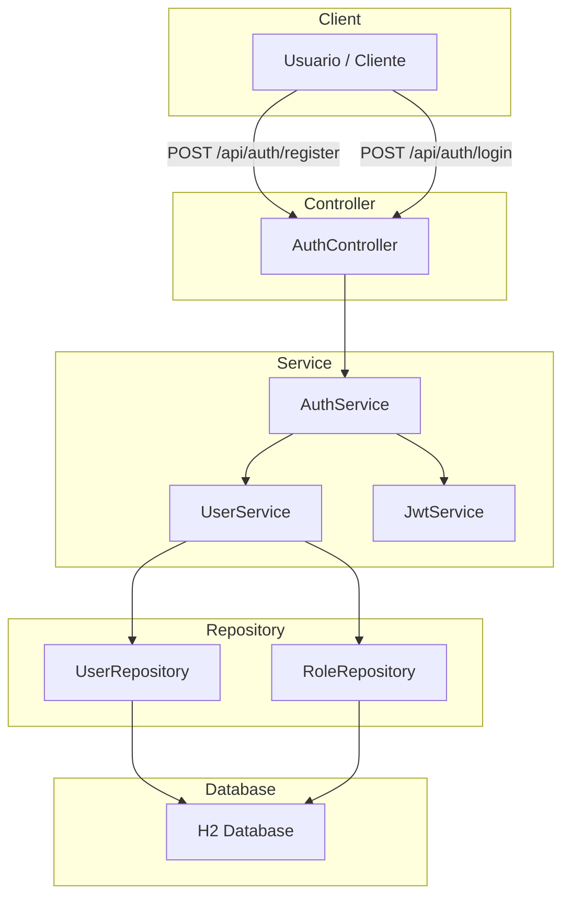
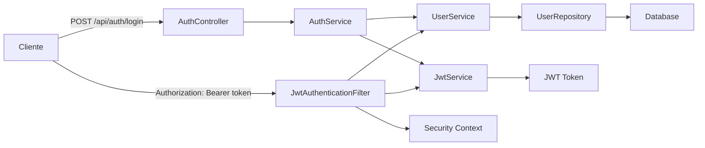
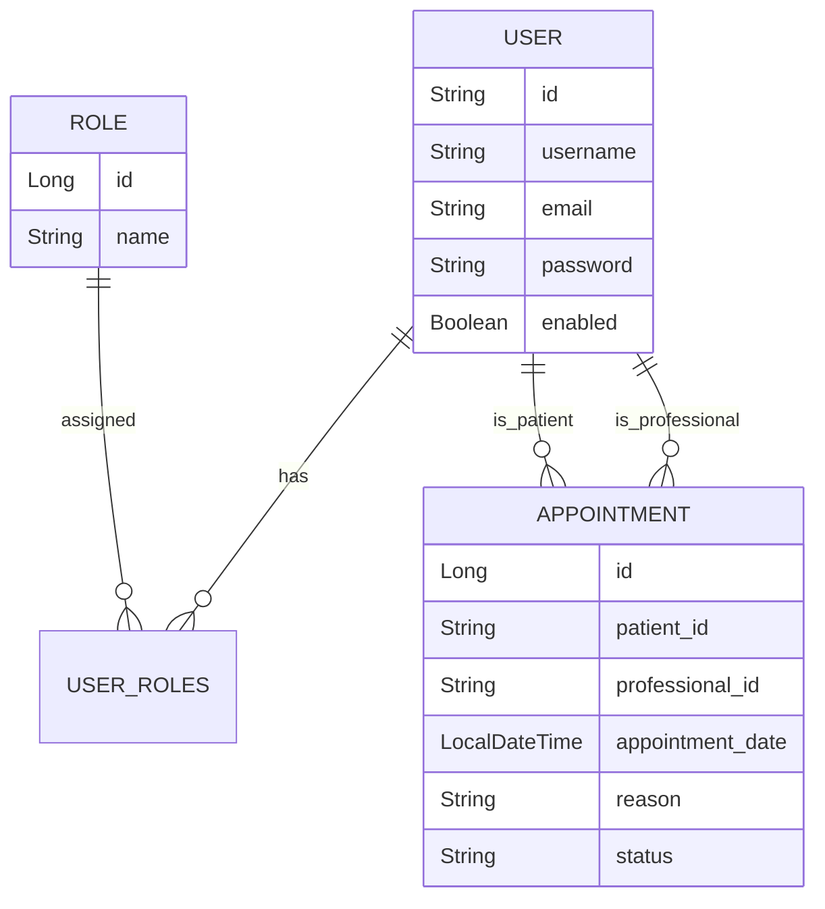

# App Fisio

Proyecto de ejemplo de un sistema de gestión de usuarios para una aplicación de fisioterapia.

## Descripción general

Este proyecto usa Spring Boot 3 con Java 17 para crear un backend REST seguro que gestiona autenticación, roles y usuarios.

La aplicación implementa:
- Autenticación JWT sin estado.
- Registro y login de usuarios.
- Roles de usuario: `ROLE_ADMIN`, `ROLE_FISIOTERAPEUTA`, `ROLE_PACIENTE`.
- Persistencia con JPA/Hibernate y base de datos H2 en memoria para desarrollo.
- Documentación de API con Swagger (SpringDoc OpenAPI).

## Objetivo

Construir una base sólida para una app de fisioterapia donde los desarrolladores principiantes puedan entender:
1. Cómo se estructura un proyecto Spring Boot.
2. Cómo funcionan los distintos paquetes y capas.
3. Por qué se usa JWT, BCrypt y capas de servicio.
4. Cómo se crean entidades JPA y repositorios de datos.

## Estructura del proyecto

```
src/main/java/com/fisitec/appfisio
├── AppFisioApplication.java
├── config
│   ├── DataInitializer.java
│   └── SecurityConfig.java
├── controller
│   └── AuthController.java
├── dto
│   ├── AuthResponse.java
│   ├── LoginRequest.java
│   ├── RegisterRequest.java
│   └── UserDTO.java
├── entity
│   ├── Role.java
│   └── User.java
├── exception
│   └── GlobalExceptionHandler.java
├── repository
│   ├── RoleRepository.java
│   └── UserRepository.java
├── security
│   ├── JwtAuthenticationEntryPoint.java
│   └── JwtAuthenticationFilter.java
└── service
    ├── AuthService.java
    ├── JwtService.java
    └── UserService.java
```

### Paquetes y responsabilidades

- `controller`: expone endpoints HTTP que el cliente usa.
- `service`: contiene la lógica de negocio y reglas de seguridad.
- `entity`: define las tablas de la base de datos.
- `repository`: gestiona el acceso a datos con Spring Data JPA.
- `security`: maneja filtros JWT y respuestas de acceso no autorizado.
- `config`: configura seguridad y carga datos iniciales.
- `dto`: usa objetos simples para recibir y enviar datos desde la API.

## Por qué cada cosa está así

### Spring Boot

Se usa Spring Boot para no tener que configurar manualmente el servidor y la mayoría de dependencias. Con Spring Boot puedes centrarte en la lógica de negocio.

### JWT (JSON Web Token)

JWT se usa para mantener la autenticación sin estado entre el cliente y el servidor.

Por qué:
- El servidor no necesita almacenar sesiones.
- El cliente envía un token en cada request.
- El token contiene el nombre de usuario y se firma con una clave secreta.

### BCrypt

Las contraseñas se guardan cifradas con BCrypt para proteger a los usuarios:
- Nunca guardes contraseñas en texto plano.
- BCrypt aplica un hash fuerte con sal integrada.

### H2 Database

H2 es una base de datos en memoria simple para desarrollo:
- No requiere instalación adicional.
- Se pierde al apagar la app, lo cual está bien para pruebas.
- Permite ver datos en `/h2-console`.

### Swagger / OpenAPI

Se agrega Swagger para que puedas probar la API desde el navegador y ver los contratos de los endpoints.

URL: `http://localhost:8080/swagger-ui/index.html`

## Diagrama de la arquitectura



## Diagrama del flujo de autenticación



## Diagrama del modelo de datos



## Descripción de las clases principales

### `AppFisioApplication`
Clase que arranca la aplicación Spring Boot.

### `SecurityConfig`
Configura Spring Security para:
- deshabilitar CSRF,
- usar JWT sin sesión,
- permitir acceso abierto a `/api/auth/**`, Swagger y H2,
- forzar autenticación en otras rutas.

### `JwtAuthenticationFilter`
Filtro que intercepta cada request y valida el token JWT del encabezado `Authorization`.

### `JwtAuthenticationEntryPoint`
Genera respuesta JSON cuando un usuario no autorizado intenta acceder a un recurso protegido.

### `AuthController`
Expone los endpoints de registro y login.

### `AuthService`
Contiene la lógica de registro y de inicio de sesión.
Registra usuarios nuevos con rol por defecto y genera tokens JWT al iniciar sesión.

### `UserService`
Gestiona operaciones de usuarios y roles:
- búsqueda por username/email,
- creación de usuarios,
- validación y cifrado de contraseñas.

### `JwtService`
Crea, valida y extrae datos de JWT. Firma el token con una clave secreta definida en `application.properties`.

### `DataInitializer`
Inserta roles iniciales y un usuario administrador al arrancar la aplicación.

### `GlobalExceptionHandler`
Maneja errores comunes de validación, credenciales inválidas y excepciones no controladas.

## Endpoints disponibles

| Método | Ruta | Descripción | Seguridad |
|---|---|---|---|
| POST | `/api/auth/register` | Registra un nuevo usuario con rol `ROLE_PACIENTE`. | Público |
| POST | `/api/auth/login` | Autentica al usuario y devuelve JWT. | Público |
| GET | `/api/v1/appointments` | Obtiene todas las citas de la clínica. | `ADMIN` |
| GET | `/api/v1/appointments/patient/{id}` | Obtiene el historial de citas de un paciente. | `ADMIN`, `PACIENTE` |
| GET | `/api/v1/appointments/professional/{id}/today` | Obtiene la agenda de hoy de un fisioterapeuta. | `ADMIN`, `FISIOTERAPEUTA` |
| POST | `/api/v1/appointments` | Agenda una nueva cita. | Todos los roles |
| GET | `/api/v1/calendar/slots` | Consulta horas libres (Simulado por ahora). | `ADMIN`, `PACIENTE`, `FISIO` |
| POST | `/api/v1/calendar/book` | Agenda una cita real en Google Calendar. | `ADMIN`, `PACIENTE` |


## Cómo ejecutar

1. Asegúrate de tener Java 17.
2. Ejecuta:
   ```bash
   mvn spring-boot:run
   ```
3. Accede a Swagger:
   ```text
   http://localhost:8080/swagger-ui/index.html
   ```
4. Accede a consola H2:
   ```text
   http://localhost:8080/h2-console
   ```
   - JDBC URL: `jdbc:h2:mem:testdb`
   - Usuario: `sa`
   - Contraseña: `password`

## Usuario administrador inicial

Se crea automáticamente un usuario administrador al iniciar la app si no existe:
- Usuario: `admin`
- Email: `admin@appfisio.com`
- Contraseña: `admin123`
- Rol: `ROLE_ADMIN`

## Notas para desarrolladores principiantes

- Si quieres añadir nuevas entidades, crea primero la clase en `entity`, luego un `Repository` y finalmente un `Service`.
- Evita poner lógica de negocio dentro de los controladores; ellos solo deben manejar solicitudes HTTP.
- Usa DTOs para separar la estructura interna de las entidades de la información que envías o recibes por la API.
- Mantén la configuración de seguridad en `config` y el código de autenticación en `security`.

## Observaciones

La documentación JavaDoc se añadió en todas las clases clave para que cada método y clase tenga una explicación clara de su función. Así quien comienza pueda leer el código y entender fácilmente cada responsabilidad.
